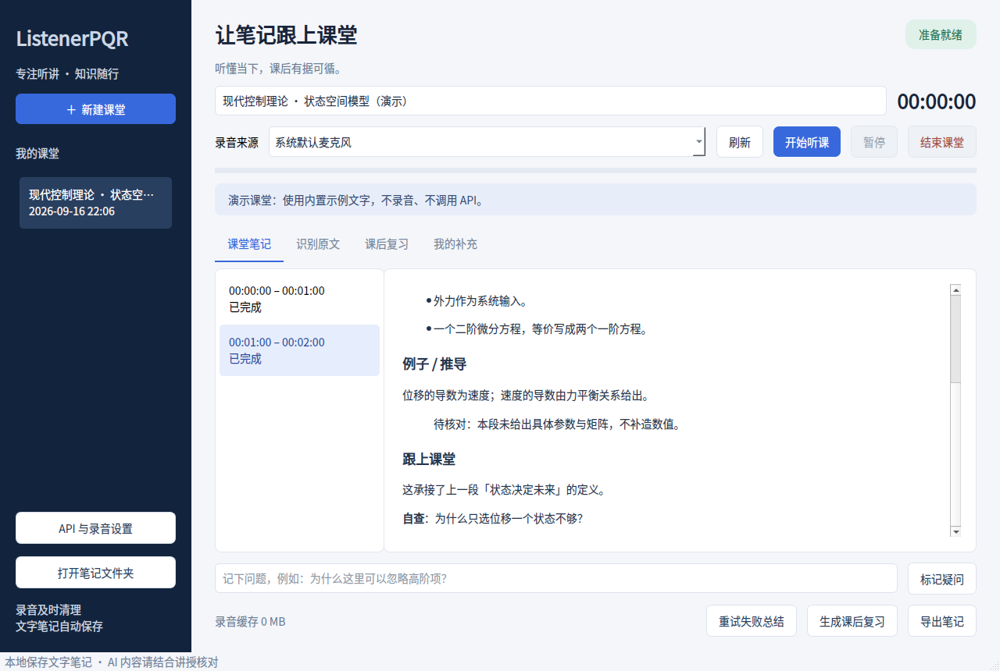

# ListenerPQR · 听课助手

面向 **Windows 11 x64** 的中文桌面程序：连续分段录音 → 语音识别 → AI 课堂总结。文字笔记自动保存，录音缓存有明确上限。

当前版本 **v0.1.0**，需要自行填写 API Key。默认每 60 秒整理一段，可调 30–300 秒；实际出结果时间还包括识别和总结耗时。



## 功能

- 连续录音、暂停/继续、结束时提交不足一段的录音，显示音量与时间。
- 按时间段整理「本段在讲什么、核心知识、例子/推导、跟上课堂」。
- 保存识别原文以便核对，失败总结可重试，不需保留录音。
- 标记当前疑问，自动保存个人补充笔记，重新打开历史课堂。
- 整堂课归纳知识脉络、待核对点与自测题，长课分批归纳。
- 导出 Markdown / UTF-8 文本，包含总结、原文、标记与个人笔记。
- 云端或本地语音识别；识别与总结服务可分别配置。
- 有限重试、静音跳过、缓存容量和保存时限限制，缺失内容明确标记。

## Win11 使用

### 免安装版

1. 打开 [Actions → Windows build](https://github.com/wumeizijiang519-beep/ListenerPQR/actions/workflows/windows.yml)，选择最近一次绿色成功的运行。
2. 从底部 **Artifacts** 下载 `ListenerPQR-Win11-x64`（通常需登录 GitHub）。
3. 解压附件，再解压其中的 `ListenerPQR-Win11-x64.zip`，进入 `ListenerPQR` 文件夹。
4. 双击 **ListenerPQR.exe**，保留旁边完整的 `_internal` 文件夹，无需安装 Python。

只有工作流成功后才有附件。发布版本标签后，也可从 [Releases](https://github.com/wumeizijiang519-beep/ListenerPQR/releases) 下载。程序未商业签名，Windows 可能显示来源提示，请核对仓库与构建记录。

### 源码版

1. 安装 [Python 3.12 x64](https://www.python.org/downloads/windows/)，保留 Python Launcher，勾选 Add Python to PATH。
2. 点击本仓库 **Code → Download ZIP**，完整解压。
3. 双击 `start.bat`。首次联网安装依赖，以后直接启动。
4. 需要本地识别时先运行 `install-local.bat`，然后在设置中切换模式。

不要在 ZIP 预览中直接运行脚本。

## API 设置

采用两步流程：**语音识别 → 文本总结**，可以混合服务。

| 组合 | 语音识别 | 文本总结 | 密钥 |
| --- | --- | --- | --- |
| OpenAI | 云端；`https://api.openai.com/v1`；如 `whisper-1` | 同地址；如 `gpt-4o-mini` | 同地址可只填总结密钥 |
| 本地识别 + DeepSeek | 本地；`small` 或模型目录 | `https://api.deepseek.com`；如 `deepseek-chat` | 仅 DeepSeek 总结密钥 |
| 独立语音服务 + DeepSeek | 支持 `/audio/transcriptions` 的服务及模型 | DeepSeek 地址和模型 | 两个服务各一把 |
| 中转站 / 本机服务 | 兼容 OpenAI multipart 音频接口，返回 `text` | 兼容 `/chat/completions`，返回 `choices[0].message.content` | 按服务配置 |

模型名是可编辑示例，以你的服务和账号实际支持为准。**文本接口兼容 OpenAI 不代表支持音频。** DeepSeek 文本模型需配合本地识别或另一家语音服务。

- 填 API **根地址**；不要填完整 `/chat/completions` 路径。中转站需要 `/v1` 时自行带上。
- 远程地址要求 HTTPS，本机 `localhost` / `127.0.0.1` 允许 HTTP；不自动跟随重定向。
- 不同地址分别填写密钥；地址相同且语音密钥留空时，沿用总结密钥。
- 密钥存系统凭据库，不写配置文件。取消保存时仅本次运行持有，并尝试删除旧凭据。
- 本地识别使用 faster-whisper / CPU int8。首次会下载模型，可能较慢；也可填写预先下载的 CTranslate2 模型目录绝对路径。
- 本地模型文件不属于录音缓存，不会自动删除。完整免安装包包含本地识别组件，模型需另行下载。

接口依据：[OpenAI 语音识别](https://developers.openai.com/api/docs/guides/speech-to-text)、[DeepSeek Chat Completions](https://api-docs.deepseek.com/api/create-chat-completion/)、[faster-whisper](https://github.com/SYSTRAN/faster-whisper)。

## 上课操作

1. Win11 **设置 → 隐私和安全性 → 麦克风**，允许桌面应用访问麦克风。
2. 填 API、课程名，选择麦克风，点击 **开始听课**。
3. 观察绿色音量条。第一段在「分段时长 + API 耗时」后出现，后台处理期间录音继续。
4. 没听懂时 **标记疑问**；板书或个人理解写入 **我的补充**。
5. 课间 **暂停**，上课 **继续听课**。暂停不录音，旧片段继续处理；时间以本堂课开始时刻为基准。
6. 下课 **结束课堂**，等待片段处理完，再 **生成课后复习** 或 **导出笔记**。

本版以麦克风为主。网课内音需系统提供「立体声混音」等输入设备，本版没有专用 WASAPI 回环录音。

## 缓存规则

| 情况 | 处理 |
| --- | --- |
| 识别成功 | 先保存文字，再立即删音频，不等总结 |
| 整段静音 | 跳过 API，删音频，保留静音时间段 |
| 超时 / 429 / 5xx | 最多尝试 3 次；耗尽后删除音频、标记失败 |
| 密钥错误 / 格式不兼容 | 不无限重试，清理音频、显示错误 |
| 等待太久 | 默认 15 分钟后删除，并标记内容缺失 |
| 接近容量限制 | 默认 64 MiB，为当前段预留空间，先删除最旧待识别段 |
| 上传文件受保护且仍无空间 | 停止录音并提示 |
| 正常退出 | 停止任务并清理未识别音频，保留文字 |
| 崩溃 / 强制退出 | 下次启动清理残留 WAV/PART，恢复文字并标记中断 |

写入中、识别中的文件受保护，时限针对等待中的文件。退出最多等待后台 5 秒；仍被系统占用的残留文件下次启动清理。断网可能造成内容缺失，时间线会显示，不能恢复已经删除的音频。

16 kHz 单声道 16 位 PCM 下，每分钟约 **1.83 MiB**。设备不支持时使用原生采样率并检查单段大小。音频内存队列最多约 5 秒，丢帧时停止并提示；识别/总结串行执行，防止并发请求堆积。

## 保存位置与限制

- `%LOCALAPPDATA%\ListenerPQR`：`notes.sqlite3`（笔记）、`settings.json`（无密钥配置）、`audio-cache`（短期录音）。界面可打开文件夹。
- 文字笔记不会自动删除。备份数据库前退出程序，或直接导出 Markdown。
- 云端识别会上传录音至指定服务；本地识别只把文字发给总结服务。录音前请确认课堂允许。
- 不识别板书/幻灯片，不区分教师身份。公式、专有名词、远距离或重叠语音可能出错，应结合讲授核对。
- 分段可能切开句子；前文摘要用于衔接，不能恢复没录到的内容。
- 远处人声误判静音时，可把阈值由 -50 降到 -60/-70 dBFS，并改善麦克风位置。
- 本地删除不代表服务商删除；接口费用、额度与数据留存以服务商政策为准。

## 开发与打包

```powershell
py -3.12 -m venv .venv
.venv\Scripts\python.exe -m pip install -e ".[dev,local]"
.venv\Scripts\python.exe -m pytest -q
.venv\Scripts\python.exe -m listenerpqr.app --demo
powershell -ExecutionPolicy Bypass -File build-windows.ps1
```

`--demo` 使用临时示例课堂，不录音、不调用 API、不混入真实记录。
`--smoke-test` 检查 GUI 启动并写入 `smoke-ok.txt`。打包脚本运行测试后启动生成的 `.exe`，验证离线界面可用。

测试覆盖分段与尾段、静音、队列上限、缓存容量/时限/保护、重启恢复、文字保存顺序、失败重试、API 格式与错误脱敏、整堂资料归纳和界面笔记隔离。

离线测试不等于真实麦克风或付费 API 验收。请先在目标 Win11 电脑试录 2–3 分钟，核对设备、接口权限和中文识别效果。

代码模块：`app.py` 入口；`ui.py` 界面；`audio.py` 录音；`ai.py` 接口；`engine.py` 后台任务；`cache.py` 空间管理；`store.py` 数据库；`config.py` 设置与密钥。

源码 MIT 许可，依赖许可见 [THIRD_PARTY_NOTICES.md](THIRD_PARTY_NOTICES.md)。
